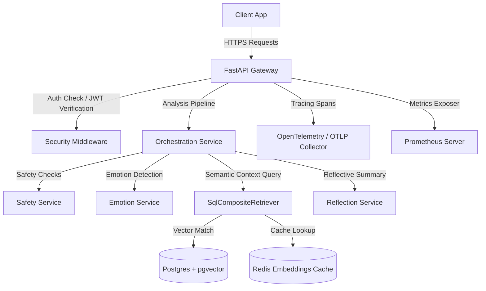

# MindCare AI (Version 2.0)

MindCare AI v2 is a modern, enterprise-grade production-ready API platform for mental health journaling, sentiment analytics, and AI-powered reflections. 

---

## 1. System Architecture



---

## 2. Core v2 Features

### 2.1 Multi-Agent AI Pipeline
Journal entries pass through an orchestration pipeline:
1. **Safety screening**: Flags crisis signals, self-harm risks, or violence.
2. **Sentiment analysis**: Categorizes primary moods and details fine-grained emotion vectors.
3. **Semantic retrieval**: Pulls relevant historic entries from vector stores.
4. **Reflection generator**: Builds a structured reflection (summary, suggestion list, follow-up questions) incorporating context.

### 2.2 Provider-Agnostic AI Integration
Uses `ReliableAIProviderWrapper` with a circuit-breaker policy (5 consecutive errors opens circuit) and automated fallback failover loops cascading across providers (Gemini -> OpenAI -> Claude -> Groq -> local Ollama).

### 2.3 Semantic Memory (RAG)
Matches text embeddings against historical records utilizing PostgreSQL `pgvector`. Employs a Redis caching layer for vector queries and features database fallbacks (`SqlJournalRetriever`) during database connection losses.

### 2.4 Production Security & Session Protections
- Secure Password hashing via `bcrypt` / `argon2`.
- JWT access tokens with rotation schemas (refresh token rotations and token blacklisting).
- IP rate limit filters targeting authentication points.
- Strict security headers (`X-Frame-Options`, `X-Content-Type-Options`) and CORS controls.

### 2.5 Observability & Monitoring
- **Prometheus**: `/metrics` path exposing HTTP request rates, latencies, tokens usage, circuit breaker states, and cost calculations.
- **OpenTelemetry**: Trace spans tracking retrievals, embeddings, safety checks, and API routes.
- **JSON Structured Logging**: Standardized JSON records with unified `request_id` and `user_id` tracking parameters.

---

## 3. Repository Layout

```text
.
├── .github/workflows/  # CI/CD pipelines (ci.yml, docker.yml, release.yml)
├── backend/            # FastAPI Backend Service
│   ├── app/            # Source Code
│   │   ├── ai/         # Provider factory and reliability wrapper
│   │   ├── api/        # REST routers
│   │   ├── auth/       # Security policies, token helpers, rate limiters
│   │   ├── core/       # Configurations, logging, telemetry, metrics
│   │   ├── db/         # SQLAlchemy schemas and DB connections
│   │   ├── rag/        # Embeddings cache and composite retrievers
│   │   └── services/   # Orchestration and AI analysis services
│   ├── tests/          # Pytest automated test scripts
│   ├── Dockerfile      # Production multi-stage Docker build
│   └── pyproject.toml  # Tool suites config (ruff, black, isort, mypy)
├── docs/               # Architecture, API & operational manuals
├── legacy/             # Streamlit legacy ML code (isolated)
└── docker-compose.yml  # Local postgres/redis/prometheus/grafana stack
```

---

## 4. Run Locally

### 4.1 Prerequisites
- Python 3.12+
- Docker & Docker Compose

### 4.2 Start Compose Stack
```bash
docker compose up --build -d
```
Runs:
- FastAPI Backend: `http://localhost:8000`
- API Metrics: `http://localhost:8000/metrics`
- Prometheus Dashboard: `http://localhost:9090`
- Grafana: `http://localhost:3001` (Default credentials: `admin/admin`)

---

## 5. Performance Benchmarks
A micro-benchmark run over 30 iterations achieved the following performance metrics:
- **Composite SQL Retrieval**: ~11.27 ms mean latency.
- **Embedding Generation**: ~0.10 ms mean latency.
- **AI Failover Penalty**: ~65.23 ms mean latency.
- **10 Concurrent Request load**: ~0.83 ms wall-time duration.

---

## 6. Future Roadmap
- [ ] Add real-time text analysis via WebSockets.
- [ ] Implement user behavior modeling for longitudinal clinical diagnostics.
- [ ] Add end-to-end encryption for stored journal entries on database disks.
