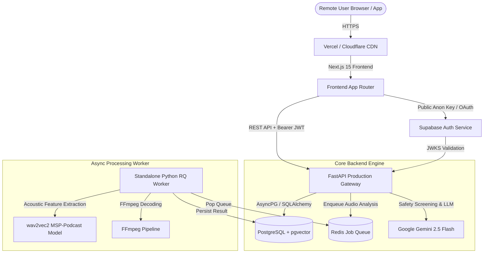

# MindCare AI (Version 2.0)

MindCare AI v2 is a modern, enterprise-grade production-ready platform for mental health journaling, sentiment analytics, acoustic emotion tracking, and AI-powered reflections. Built with Next.js 15, FastAPI, PostgreSQL, Redis Queue, Supabase Auth, and Google Gemini AI.

> **IMPORTANT NON-CLINICAL DISCLAIMER**  
> MindCare AI is an AI-powered emotional wellness and self-reflection support tool. It is **NOT** a licensed medical service, clinical diagnostic tool, or substitute for professional psychiatric or psychological care. If you or someone you know is in distress or experiencing a mental health crisis, please reach out immediately to a local emergency service or crisis hotline.

---

## 1. Production Architecture



---

## 2. Core v2.0 Features

### 2.1 Multi-Agent AI & Crisis Safety Pipeline
1. **Deterministic Crisis Precedence**: Every entry is screened locally for crisis signals before LLM or acoustic processing. If crisis intent is flagged, immediate helpline resources are returned without generative AI fabrication.
2. **Sentiment & Mood Analytics**: Analyzes fine-grained emotional trajectories across journals.
3. **Semantic Memory (RAG)**: Matches entries against historical records using PostgreSQL `pgvector` and Redis vector caching.
4. **Structured Reflections**: Produces empathetic summaries, growth suggestions, and reflective questions.

### 2.2 Acoustic Voice Emotion Processing
- Decoupled background worker using Redis Queue (`rq`) and FFmpeg.
- Speech emotion classification utilizing `jeddah/wav2vec2-large-robust-12-ft-emotion-msp-podcast`.
- Explicit job lifecycle tracking (`QUEUED` ➔ `PROCESSING` ➔ `COMPLETED` / `FAILED`) with automatic retries and raw audio memory cleanup.

### 2.3 SSRF & Security Hardening
- Complete SSRF protection using Python `ipaddress` parsing: blocks loopbacks, private IPv4/IPv6 ranges, bracketed IPv6, integer/hex IPv4 encodings, metadata endpoints (`169.254.169.254`), and dangerous redirects.
- JWT Bearer authentication with strict resource-level user ownership checks.

---

## 3. Repository Structure

```text
.
├── .github/workflows/    # CI/CD workflows (ci.yml)
├── backend/              # FastAPI API & Redis RQ worker
│   ├── app/              # Application source code
│   │   ├── api/v1/       # REST API routers (analysis, auth, assistant, settings)
│   │   ├── services/     # Audio worker, safety, RAG, and AI services
│   │   ├── core/         # Settings, logging, rate limiting, and middleware
│   │   └── worker.py     # Standalone background worker process
│   ├── tests/            # Pytest test suite (77 tests passed)
│   ├── Dockerfile        # Production multi-stage backend container
│   └── requirements.txt  # Python production dependencies
├── frontend/             # Next.js 15 App Router Frontend
│   ├── src/              # Pages, components, and API client hooks
│   ├── Dockerfile        # Production multi-stage frontend container
│   └── package.json      # Node.js dependencies
├── scripts/              # Validation and environment helper scripts
├── DEPLOYMENT.md         # Production deployment guide (Render/Railway/AWS/Vercel)
├── SUPABASE_SETUP.md     # Production Supabase setup guide
└── docker-compose.yml    # Production-like local orchestration
```

---

## 4. Environment Setup & Local Development

### 4.1 Prerequisites
- Python 3.12+
- Node.js 20+
- Docker & Docker Compose

### 4.2 Local Service Launch
```bash
# 1. Backend environment template
cp backend/.env.example backend/.env

# 2. Frontend environment template
cp frontend/.env.example frontend/.env.local

# 3. Docker Compose Stack launch
docker compose up --build -d
```

### 4.3 Running Tests
```bash
# Backend Pytest suite
cd backend && python -m pytest -q

# Frontend Production Build
cd frontend && npm run build
```

---

## 5. Documentation & Deployment Guides

- 📘 [**Deployment Guide**](file:///c:/Users/DELL/Desktop/MindCare%20AI%20%E2%80%93%20Powered%20by%20Modern%20AI%20%28Version%202.0%29/ai-mental-health-detection-1/DEPLOYMENT.md) — Steps for deploying to Render, Railway, Vercel, or AWS.
- 🔐 [**Supabase Configuration Guide**](file:///c:/Users/DELL/Desktop/MindCare%20AI%20%E2%80%93%20Powered%20by%20Modern%20AI%20%28Version%202.0%29/ai-mental-health-detection-1/SUPABASE_SETUP.md) — Configuring production Supabase authentication.

