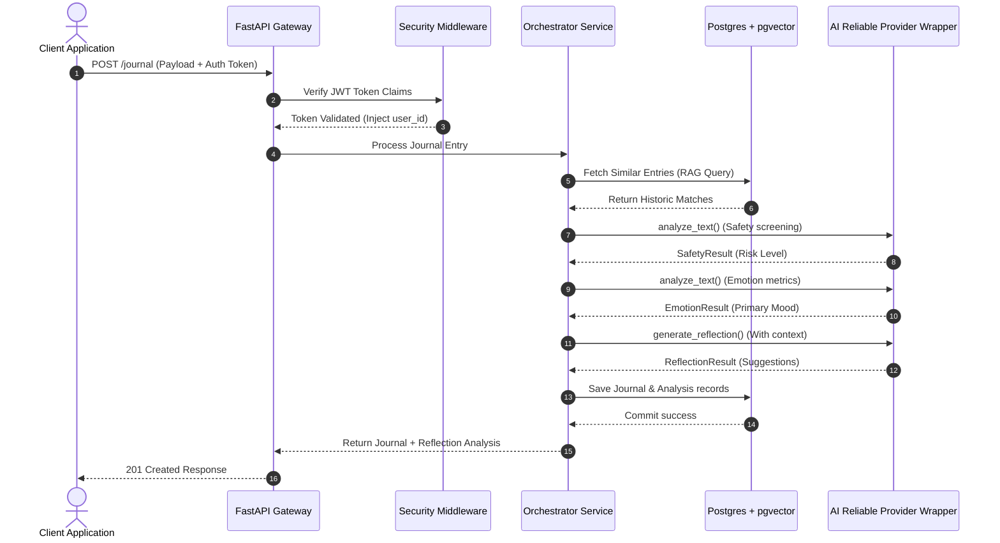
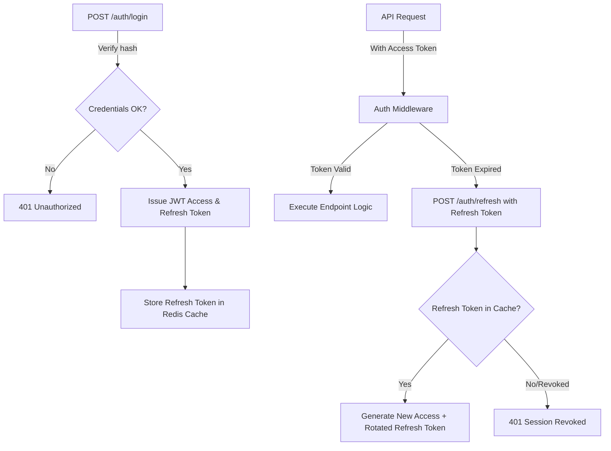
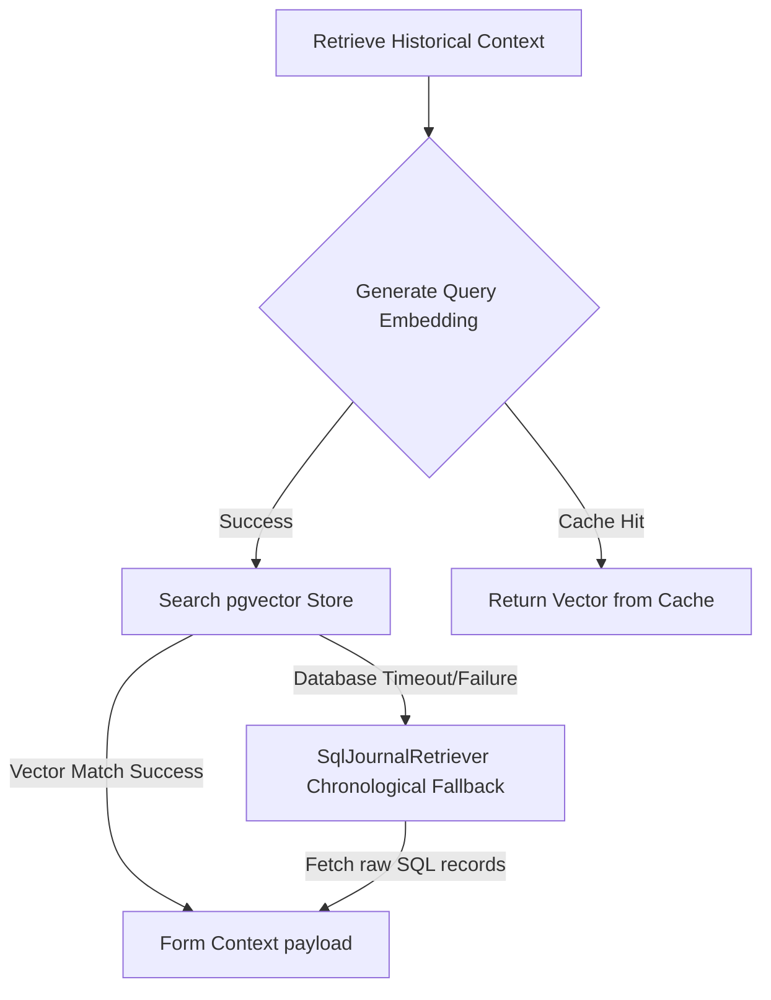
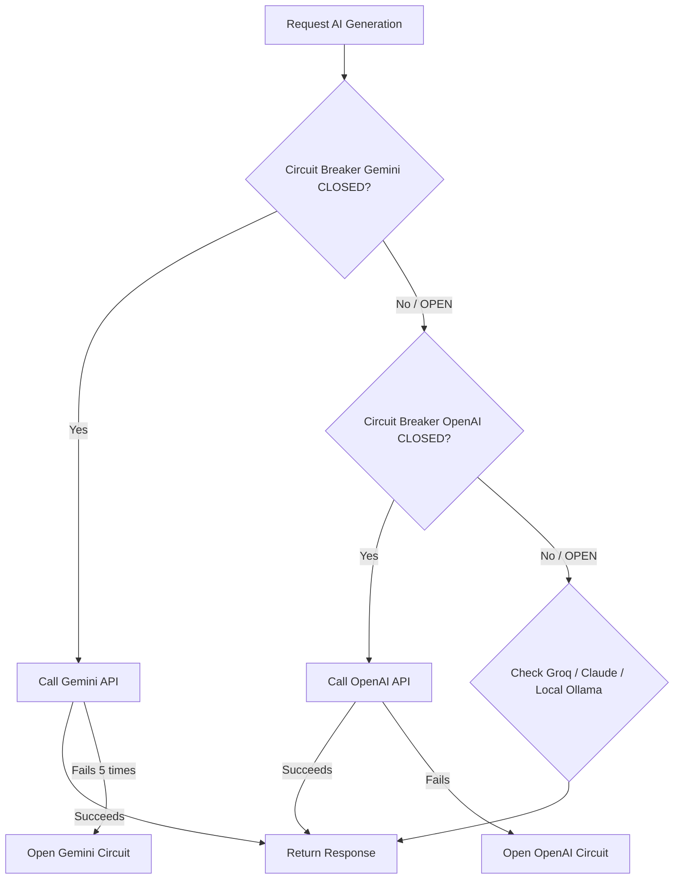

# MindCare AI Architecture Specification

This document details the system design, RAG, and instrumentation details for MindCare AI v2.

---

## 1. Complete System Flow

---

## 2. Authentication Flow

JWT Authentication utilizes access and refresh tokens.

---

## 3. RAG Retrieval Pipeline

Our RAG system couples vector matching with chronological fallbacks.

---

## 4. AI Provider Failover (Circuit Breaker)

Ensures zero downtime by routing across available models.

---

## 5. Telemetry & Monitoring Architecture

System indicators trace requests down to operational infrastructure.

- **FastAPI Middleware**: Automatically tracks HTTP latencies (`http_request_duration_seconds`) and response states (`http_requests_total`).
- **OpenTelemetry Tracer**: Wraps retrieval database queries (`rag_retrieve`), embedding processes (`generate_and_store_embedding`), and external provider invocations.
- **Prometheus Scraper**: Polls the `/metrics` endpoint to monitor metrics globally.
- **Grafana Panel Grid**: Displays system indicators on dashboard layouts.
